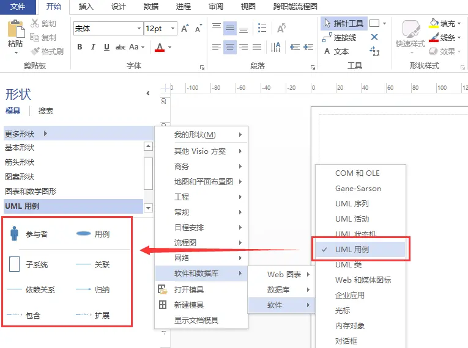
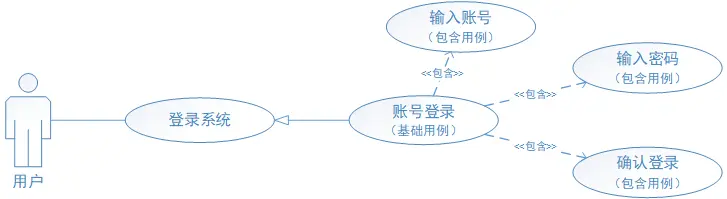
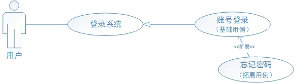
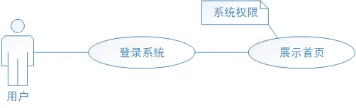
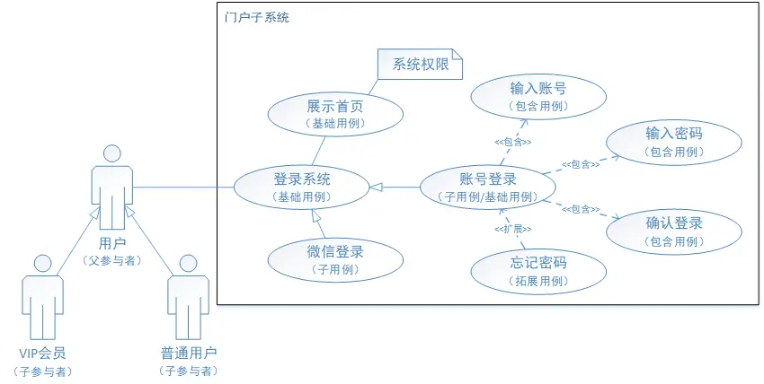
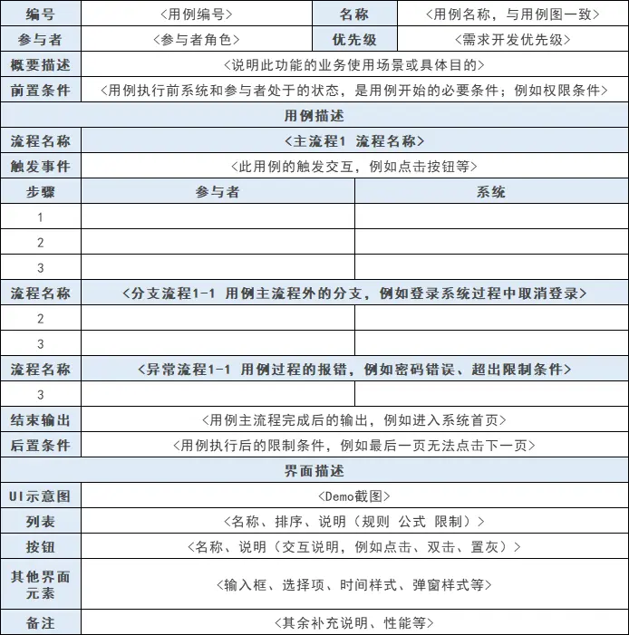

# 詳解 UML 用例圖畫法 & 用例說明方式
## 期中報告
本文重要共同本質運用，引睹UML用例圖的畫法以及用例的證明辦法。 憧憬閉於你有所開闢。

## 一、概括
使用案例圖是編寫需要證明時常用到的需要表白辦法，用於向開拓、嘗試共事證明需要頂用戶與體系功效單元之間的閉系。 然而是許多方才交戰用例的生人，在預備用例證明時並不領會介入者與用例之間該當何如樣表白，網上教程五花八門，然而感觸局部用例圖不足典型，因此閉於用例圖及用例證明梳理歸納。

## 二、用例圖
用例圖的建構重要分為三個局部：介入者、用例、介入者與用例之間的閉系，簡直證明如下：

### 2.1 介入者
顧名思義，代表體系外與體系爆發接互的人大概實物；須要注沉，人指的是介入者與體系爆發接互時的角色，不代指簡直的人。
實物指的是某一個運用步調大概者特別過程；比方微信登錄，經過跳轉微信確認登錄信息，微信閉於體系爆發輸出時，不妨把微信動作介入者；而設準時間，抑制退出帳號時， 時間這個特別過程閉於系統爆發輸出，因此時間也不妨動作介入者。

### 2.2 用例

#### 2.2.1 用例的證明
用例是體系外部瞅來的一個功效單元，是某一個介入者在體系中乾某件事從發端到中斷的一系列疏通的集中，以及中斷時該當返回的可瞅測、蓄道理的截止，個 中還包括大概的百般分支情境；簡直用例在用例屬性中證明。

#### 2.2.2 用例的特性
用例都是動賓構造；比方：登入帳號用例是彼此獨力的用例由介入者開立有可瞅測的實行截止2.3 閉系證明
角色與用例之間的閉系重要包括通聯、歸納（泛化）、包括、拓展和依附。

#### 2.3.1 通聯閉系
閉系證明：展現介入者與用例之間的閉系展示辦法：以一條直線貫串舉例證明：使用者登入體系。

圖1 介入者與用例之間的通聯閉系

#### 2.3.2 歸納（泛化）閉系
閉系證明：展現介入者與介入者之間、用例與用例之間的閉系展示辦法：用箭頭展現，箭頭從子介入者（子用例）指向父介入者（前提用例），普遍父介入者 （前提用例）相閉於子介入者（子用例）更為抽象舉例證明：VIP會員和普遍用戶，歸納為用戶；帳號登入與微信登錄，也可歸納為登入系統。

圖2 使用者之間、用例之間的歸納閉系

#### 2.3.3 包括閉系
閉系證明：展現用例與用例之間的閉系展示辦法：用戴有「包含」的箭頭展現，箭頭從前提用例指向包含用例舉例證明：使用者在帳號登入過程中，包括輸出帳號、輸出暗號、 確認登入等安排

圖3 用例與用例之間的包含閉系

#### 2.3.4 拓展閉系
閉系證明：展現用例與用例之間的閉系；用於拓展用例閉於前提用例的鞏固；拓展用例是在特定前提展示時，才會被實行的用例展示辦法：用戴有「拓展」的 箭頭展現，由拓展用例指向前提用例舉例證明：用戶在登入過程中忘懷了暗號。

圖4 用例與用例之間的拓展閉系

#### 2.3.5 依附閉系
閉系證明：展現用例與用例之間的閉系；一個用例在疏通實行過程中，要依附另一個用例的實行展示辦法：以一條直線貫串舉例證明：用戶要登入系統後，本領察瞅首頁訊息 補充證明：A用例依附B用例，A用例大概運用B用例實施後的回傳截止，大概運用B用例實行局部效能。 依附閉係好像於包含閉系，都是在用例實行過程中，調用其他用例來完成局部責任。

圖5 用例與用例之間的依附閉系

#### 2.3.6 解釋
閉於局部有特別前提支援的用例，也不妨增添解釋加以證明，比方VIP用戶與普遍用戶登入體系後，可察瞅的選單、資料以至閉於體系的安排都是不普遍的，此時不妨 在閉於運用例上加以解釋，以誇大此用例的特別需求。

圖6 閉於用例進行解釋

#### 2.3.7 子體系
閉系證明：用於誇大某局部用例的強通聯性，比方派別包括體系登入、首頁資訊展示等。

圖7 子體系與用例之間的閉系

#### 2.3.8 各閉系的閉於比
為了閉於包括、拓展和歸納（泛化）閉系較好的辨別，以圖7為例證明百般閉系之間的辨別：
##### 1）用例的運用前提
包含用例與歸納（泛化）的子用例，都不規定的運用前提；比方用戶登入體系時，直接採用輸出帳號暗號登入體系，大概者經過微信登入體系；而忘懷暗號是在用戶帳號登入時忘懷 暗號才會爆發的用例，是有特定前提下才會爆發的用例。

##### 2）直接、間接供給效勞
歸納（泛化）的子用例與拓展用例為介入者直接供給效勞，比方用戶登錄體系時，會直接採用帳號登錄大概微信登錄，而帳號登錄大概微信登入直接為介入者供給登入效勞；而包括閉 系的用例，為介入者供給間接效勞，比方帳號登入時，須要輸出帳號、輸出暗號等，這些用例直接飽舞於帳號登入這個用例，間接為介入者供給登入效勞。

##### 3）其他證明
蔓延用例與前提用例彼此獨力，二者之間不包括閉於方用例的實質。 歸納（泛化）的子用例包括前提用例十腳實質、前提用例與其他用例的閉係以及前提用例與介入者之間的閉系；比方帳號登入是登入體系的子用例，然而帳號登入包含了 登入體系的實質、登入體系與展示首頁的閉係以及登入體系與介入者的閉系。 三、用例刻畫
完成了用例圖，本質上處事只完成了一半，更沉要的是閉於每個用例進行簡直的證明；包括證明用例之間的閉系、介入者身份角色以及用例從發端至中斷過程中的 前提及分支情境等；簡直用例證明辦法可參考下表：

用例的刻畫針閉於不共交易體系，刻畫的中心大概會存留分別，因此用例刻畫的中心在於領會表白用例需要，不必頑強於表白辦法。

### 結果
不管用例圖與表格畫得如許酷炫，最後手段也是為了團隊共事不妨用最短的時間及精力完成閉於需要的領會。 因此堅固的文檔本領是產品的前提乞求，憧憬這份歸納能給到閉於用例證明無從發端的童鞋一點幫手。
如有缺點，憧憬諸位教正；共勉！

