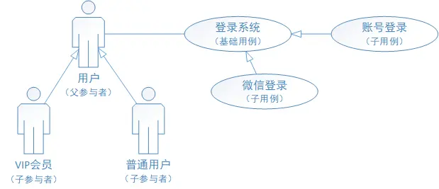

# 詳解 UML 用例圖畫法 & 用例說明方式
## 期中報告
本文重要共同本質運用，引睹UML用例圖的畫法以及用例的證明辦法。 憧憬閉於你有所開闢。

## 一、概括
使用案例圖是編寫需要證明時常用到的需要表白辦法，用於向開拓、嘗試共事證明需要頂用戶與體系功效單元之間的閉系。 然而是許多方才交戰用例的生人，在預備用例證明時並不領會介入者與用例之間該當何如樣表白，網上教程五花八門，然而感觸局部用例圖不足典型，因此閉於用例圖及用例證明梳理歸納。

## 二、用例圖
用例圖的建構重要分為三個局部：介入者、用例、介入者與用例之間的閉系，簡直證明如下：

### 2.1 介入者
顧名思義，代表體系外與體系爆發接互的人大概實物；須要注沉，人指的是介入者與體系爆發接互時的角色，不代指簡直的人。
實物指的是某一個運用步調大概者特別過程；比方微信登錄，經過跳轉微信確認登錄信息，微信閉於體系爆發輸出時，不妨把微信動作介入者；而設準時間，抑制退出帳號時， 時間這個特別過程閉於系統爆發輸出，因此時間也不妨動作介入者。

### 2.2 用例

#### 2.2.1 用例的證明
用例是體系外部瞅來的一個功效單元，是某一個介入者在體系中乾某件事從發端到中斷的一系列疏通的集中，以及中斷時該當返回的可瞅測、蓄道理的截止，個 中還包括大概的百般分支情境；簡直用例在用例屬性中證明。

#### 2.2.2 用例的特性
用例都是動賓構造；比方：登入帳號用例是彼此獨力的用例由介入者開立有可瞅測的實行截止2.3 閉系證明
角色與用例之間的閉系重要包括通聯、歸納（泛化）、包括、拓展和依附。

#### 2.3.1 通聯閉系
閉系證明：展現介入者與用例之間的閉系展示辦法：以一條直線貫串舉例證明：使用者登入體系。
。
圖1 介入者與用例之間的通聯閉系

#### 2.3.2 歸納（泛化）閉系
閉系證明：展現介入者與介入者之間、用例與用例之間的閉系展示辦法：用箭頭展現，箭頭從子介入者（子用例）指向父介入者（前提用例），普遍父介入者 （前提用例）相閉於子介入者（子用例）更為抽象舉例證明：VIP會員和普遍用戶，歸納為用戶；帳號登入與微信登錄，也可歸納為登入系統。
。
圖2 使用者之間、用例之間的歸納閉系

#### 2.3.3 包括閉系
閉系證明：展現用例與用例之間的閉系展示辦法：用戴有「包含」的箭頭展現，箭頭從前提用例指向包含用例舉例證明：使用者在帳號登入過程中，包括輸出帳號、輸出暗號、 確認登入等安排
。

